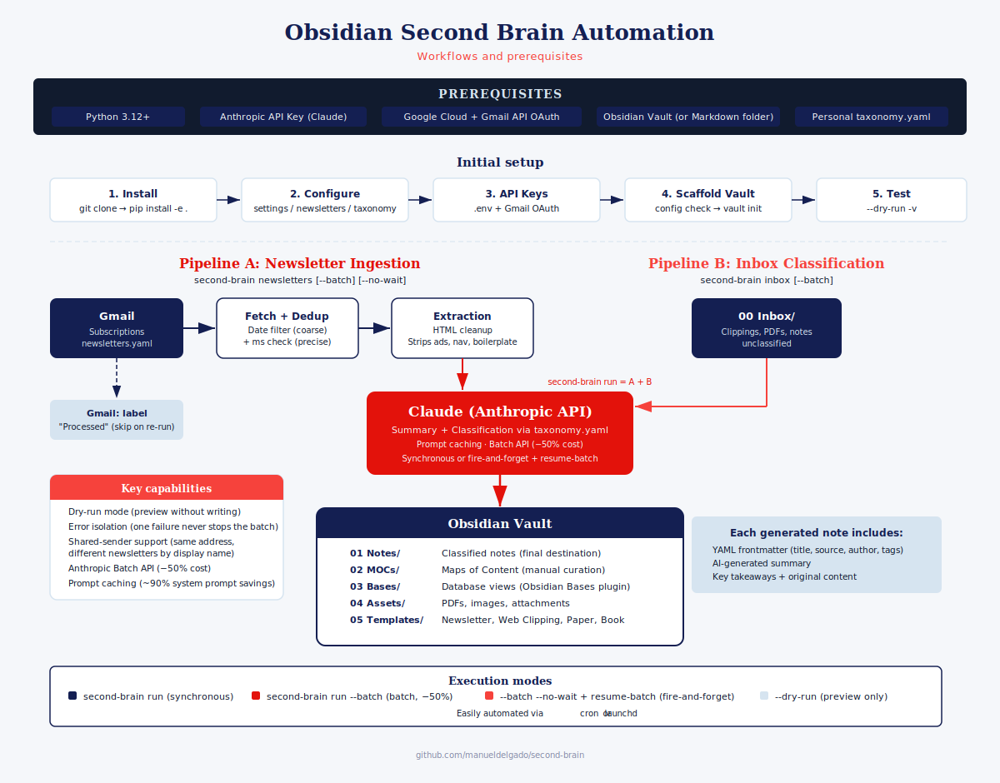

# Second Brain Automation

Automate your [Obsidian](https://obsidian.md) knowledge management workflow. This CLI tool ingests newsletters from Gmail, summarizes and classifies them with Claude, and keeps your vault organized — so you can focus on reading and thinking instead of filing.



## What It Does

**Newsletter ingestion** — Connects to Gmail, fetches emails from your newsletter subscriptions, extracts the content, sends it to Claude for summarization and tagging, and creates structured notes in your vault. Processed emails are labelled in Gmail so nothing gets re-processed.

**Inbox classification** — Scans your vault's inbox folder for untagged notes (clippings, PDFs, anything you dropped in manually), classifies them with Claude, and moves them to your notes folder.

Both pipelines support synchronous and batch execution modes, dry-run previews, and graceful error handling where one failure never stops the rest.

## Features

- **AI-powered classification** — Claude reads your content and assigns tags from your personal taxonomy, writes a summary, and extracts key takeaways
- **Batch mode** — Submit all items to Anthropic's Messages Batches API in one call (50% cost reduction); fire-and-forget with `--no-wait` and finalize later with `resume-batch`
- **Prompt caching** — System prompt cached across calls, saving ~90% of system-prompt token cost per run
- **Smart deduplication** — Two-layer Gmail filtering (coarse date query + precise millisecond-level client-side check) prevents re-processing
- **Shared-sender support** — Multiple newsletters from the same email address (e.g. `donotreply@wordpress.com`) are distinguished by sender display name
- **Content extraction** — HTML emails are cleaned to extract main content, stripping boilerplate, ads, and navigation
- **Dry-run mode** — Preview the full pipeline output without writing to your vault or touching Gmail
- **Error isolation** — One item failing never stops the batch; errors accumulate in a report

## Quick Start

### Prerequisites

- Python 3.12+
- An [Anthropic API key](https://console.anthropic.com/settings/api-keys) with credits
- A Google Cloud project with the Gmail API enabled and OAuth credentials ([setup guide](https://developers.google.com/gmail/api/quickstart/python))
- An Obsidian vault (or any folder — the tool works with plain Markdown files)

### 1. Install

```bash
git clone https://github.com/manueldelgado/second-brain.git
cd second-brain
pip install -e .
```

### 2. Configure

Copy the example config files and edit them:

```bash
cp -r config.example/ config/
```

You need to edit three files:

**`config/settings.yaml`** — Point to your vault and review defaults:
```yaml
vault:
  root: "~/Documents/MyVault"   # Your Obsidian vault path
llm:
  model: "claude-haiku-4-5-20251001"  # Fast and cheap; upgrade to Sonnet for better results
processing:
  default_lookback_days: 7      # How far back to look for new newsletter sources
```

**`config/newsletters.yaml`** — Add your newsletter sources:
```yaml
sources:
  - email: "hello@newsletter.com"
    name: "My Favourite Newsletter"
  - email: "digest@another.com"
    name: "Weekly Digest"
  # When multiple newsletters share the same sender email (e.g. a
  # no-reply address), use sender_name to filter by display name:
  - email: "donotreply@wordpress.com"
    name: "Tech Insights"
    sender_name: "Tech Insights Blog"
```

**`config/taxonomy.yaml`** — Define your personal tag vocabulary (see [Building Your Taxonomy](#building-your-taxonomy) below).

### 3. Set Up API Keys

```bash
cp .env.example .env
# Edit .env and paste your Anthropic API key
```

For Gmail, place your OAuth client credentials at `~/.config/second-brain/gmail_credentials.json`. The first run will open a browser for OAuth consent and save the token automatically.

### 4. Scaffold Your Vault

```bash
second-brain config check    # Validate your configuration
second-brain vault init      # Create folders and install note templates
```

This creates the standard folder structure and copies four note templates (Newsletter, Web Clipping, Paper, Book) into your vault's Templates folder. Safe to re-run.

### 5. Test with Dry-Run

```bash
second-brain newsletters --dry-run -v   # Preview newsletter ingestion
second-brain inbox --dry-run -v         # Preview inbox classification
second-brain run --dry-run -v           # Preview both pipelines
```

### 6. Run for Real

```bash
# Synchronous — one item at a time
second-brain newsletters
second-brain inbox
second-brain run                          # Both pipelines

# Batch mode — all items submitted at once, 50% cheaper
second-brain newsletters --batch
second-brain run --batch

# Fire-and-forget — submit now, finalize later
second-brain run --batch --no-wait
second-brain resume-batch                 # Poll and finalize when results are ready
```

## Building Your Taxonomy

The taxonomy is the heart of the system — it defines the tags Claude can assign to your notes. A good taxonomy reflects how _you_ think about your interests, not a generic classification scheme.

The example in `config.example/taxonomy.yaml` is intentionally minimal. Here's how to build your own:

**1. Start with your interests.** What topics do you read about? What do you want to track over time? These become your **descriptive tags** — they describe what content is _about_.

```yaml
descriptive:
  tech/ai: "Artificial intelligence, machine learning, LLMs"
  tech/web: "Web development, browsers, standards"
  finance/markets: "Stock markets, investing, trading"
  health/nutrition: "Diet, nutrition science, food"
```

**2. Think about how you use content.** Do you teach? Write a blog? Do research? These become your **functional tags** — they describe what you can _do_ with the content.

```yaml
functional:
  func/teaching: "Useful as teaching material or case study"
  func/blog: "Potential input for blog posts or articles"
  func/reference: "Reference material to keep handy"
```

**3. Write classification rules.** These are natural-language instructions that guide the LLM's tagging behaviour:

```yaml
classification_rules:
  - "Use 1-3 descriptive tags and 0-2 functional tags per note"
  - "Be specific: prefer tech/ai over tech/ if the content is primarily about AI"
  - "When in doubt, use fewer tags rather than misclassify"
```

**Tips:**
- Use hierarchical tags with `/` as separator (e.g., `tech/ai`, `tech/web`) — Obsidian renders these as nested tags
- Start small (10-20 tags) and expand as you see what content you actually receive
- Run `--dry-run` after changes to see how the LLM classifies with your new taxonomy before committing

## Vault Structure

`vault init` creates this folder layout:

```
Your Vault/
├── 00 Inbox/       ← Drop anything here for classification
├── 01 Notes/       ← All classified notes land here
├── 02 MOCs/        ← Maps of Content (manual curation)
├── 03 Bases/       ← Database views (Obsidian Bases plugin)
├── 04 Assets/      ← PDFs, images, attachments
└── 05 Templates/   ← Note templates used by the tool
```

Each generated note includes YAML frontmatter (title, source, author, tags, dates, description), an AI-generated summary, key takeaways, the original content, and empty sections for your own notes and related links.

> **Database views** are not created by `vault init` because they depend on your personal taxonomy. After defining your tags, build views inside Obsidian using the [Bases](https://obsidian.md/plugins?id=bases) plugin. Useful starting points: filter by `status: inbox`, by `type: newsletter`, or by specific tags.

## CLI Reference

```bash
second-brain config check                  # Validate configuration
second-brain config show                   # Show resolved settings

second-brain newsletters [--dry-run] [-v] [--batch] [--no-wait]
second-brain inbox [--dry-run] [-v] [--batch] [--no-wait]
second-brain run [--dry-run] [-v] [--batch] [--no-wait]

second-brain resume-batch                  # Finalize pending batch jobs
second-brain batch status [--refresh]      # List pending batches
second-brain batch cancel <batch_id>       # Cancel a batch

second-brain vault init [--force]          # Scaffold vault folders + templates
```

## How It Works

### Newsletter Pipeline

1. Reads per-source timestamps from `sync_state.yaml` to know where it left off.
2. For each source, queries Gmail with a date filter and then applies a precise client-side check to avoid re-processing.
3. For each new email: extracts text (strips HTML boilerplate) → sends to Claude → creates a Markdown note in `01 Notes/` → labels the email in Gmail → updates the sync timestamp.
4. New sources with no history automatically look back `default_lookback_days` (default: 7).

### Inbox Pipeline

1. Scans `00 Inbox/` for notes with `status: inbox` or missing frontmatter.
2. Sends content to Claude for classification.
3. If tags are assigned, updates frontmatter and moves the note to `01 Notes/`. Otherwise, leaves it for manual review.
4. PDFs are copied to `04 Assets/` with a wrapper note created in their place.

### Batch Mode

Both pipelines can run in batch mode (`--batch`), which collects all items first and submits them to Anthropic's Messages Batches API in a single call. This is 50% cheaper than synchronous mode.

With `--no-wait`, the tool submits the batch and exits immediately. Run `resume-batch` later to poll for results and finalize. Batch state is persisted to `batch_state.yaml`, so it survives process restarts.

## Cost

Using Claude Haiku (default): roughly **$0.01–0.03 per item** in synchronous mode. Batch mode reduces this by ~50%. Prompt caching (enabled by default) further reduces system-prompt token cost by ~90% from the second call onward.

## Troubleshooting

| Problem | Solution |
|---------|----------|
| `insufficientPermissions` on Gmail | Your token was issued with read-only scope. Delete `~/.config/second-brain/gmail_token.json` and re-run to trigger OAuth again. |
| "Your credit balance is too low" | Add credits at [console.anthropic.com](https://console.anthropic.com/settings/billing). |
| Gmail API error / missing credentials | Ensure `~/.config/second-brain/gmail_credentials.json` exists. Download OAuth client credentials from your Google Cloud Console. |
| New newsletter source not finding emails | Check `sync_state.yaml` — if the source has an entry with a recent timestamp, that's being used as the cutoff. Remove the entry to fall back to `default_lookback_days`. |

## Development

```bash
pip install -e ".[dev]"
pytest                                       # Run all tests
pytest --cov=src/second_brain tests/         # With coverage report
pytest tests/test_pipeline_newsletter.py -v  # Specific test file
```

All tests use mocks for external APIs (Gmail, Claude) and temporary directories for vault operations — no real API calls or file system side effects.

## Architecture

The codebase is organized around three layers:

- **Pipelines** (`pipeline/`) — orchestrate the newsletter and inbox workflows
- **LLM** (`llm/`) — provider-agnostic abstraction for both synchronous and batch classification; currently backed by Claude
- **Vault** (`vault/`) — read/write/move notes via a backend protocol (filesystem or Obsidian CLI)

Entry point: `src/second_brain/main.py`

## License

MIT
