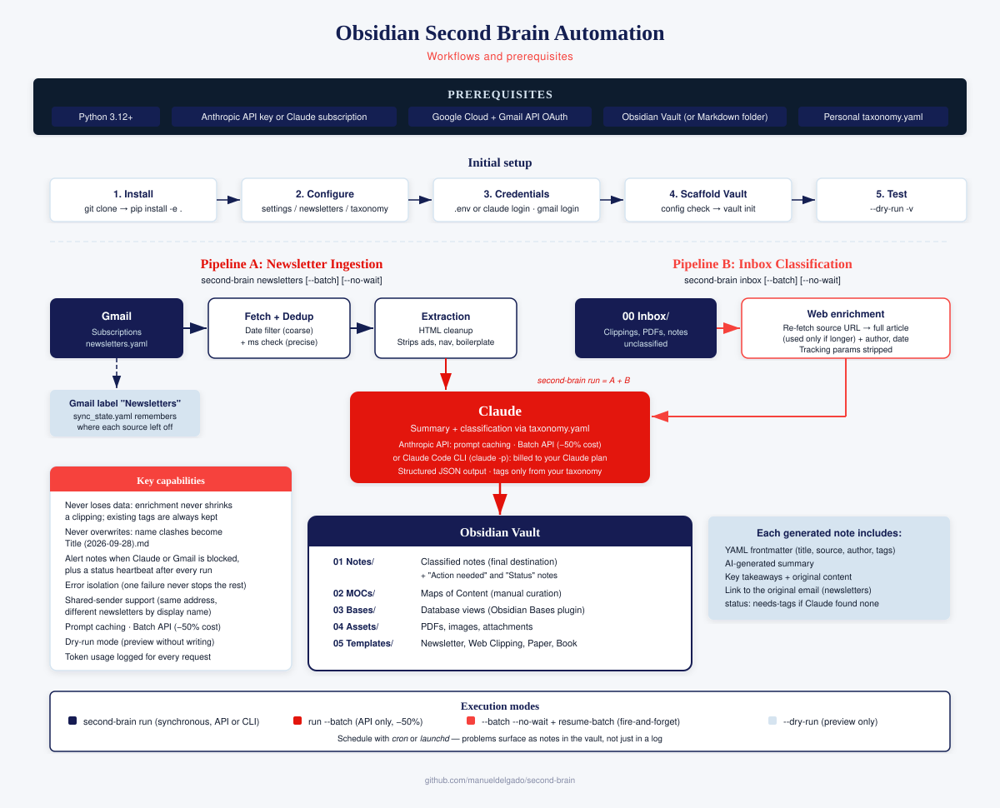

# Second Brain Automation

Automate your [Obsidian](https://obsidian.md) knowledge management workflow. This CLI tool ingests newsletters from Gmail, summarizes and classifies them with Claude, and keeps your vault organized — so you can focus on reading and thinking instead of filing.



## What It Does

**Newsletter ingestion** — Connects to Gmail, fetches emails from your newsletter subscriptions, extracts the content, sends it to Claude for summarization and tagging, and creates structured notes in your vault. Processed emails are labelled in Gmail so nothing gets re-processed.

**Inbox classification** — Scans your vault's inbox folder for untagged notes (clippings, PDFs, anything you dropped in manually), re-fetches each clipping's source page to recover the full article and missing metadata, classifies it with Claude, and moves it to your notes folder.

Claude can be reached two ways: through the **Anthropic API** (pay per token, with an optional 50%-cheaper batch mode) or through the **local Claude Code CLI** (`claude -p`), billed to your Claude subscription instead of an API key. Both pipelines support dry-run previews and graceful error handling where one failure never stops the rest, and are designed to run unattended on a schedule — problems show up as notes in your vault, not just in a log file.

## Features

- **AI-powered classification** — Claude reads your content and assigns tags from your personal taxonomy, writes a summary, and extracts key takeaways
- **Two LLM providers** — the Anthropic API (`claude`, default) or the local Claude Code CLI (`claude_cli`), which runs on your Claude subscription and never sees your API key
- **Batch mode** (API provider) — Submit all items to Anthropic's Messages Batches API in one call (50% cost reduction); fire-and-forget with `--no-wait` and finalize later with `resume-batch`. Items already in a pending batch are never resubmitted
- **Net-positive web enrichment** — Inbox clippings are re-fetched from their source URL to recover the full article as clean Markdown, plus author and date. The captured content is only replaced when the fetch is *longer*, so paywalled captures are never shrunk; tracking parameters (`utm_*`, `fbclid`, …) are stripped from the source URL
- **Never loses data** — Existing tags are kept verbatim and merged with taxonomy-validated tags from Claude; notes Claude couldn't tag are flagged `status: needs-tags` instead of being left behind; existing vault files are never overwritten (a taken name gets the publication date, `Title (2026-09-28).md`)
- **Unattended visibility** — If Claude or Gmail stops working (logged out, token revoked, plan limit reached), the run stops, exits non-zero and writes an *Action needed* note to your notes folder; it disappears on its own once things work again. A *Status* note is updated after every run as a heartbeat
- **Structured outputs** — Claude's answer always matches a JSON schema, and tags can only come from your taxonomy
- **Prompt caching** — System prompt cached across calls (on models whose minimum cacheable prompt length your taxonomy exceeds, e.g. Sonnet 5 but not Haiku 4.5)
- **Token usage logging** — Every request logs its input, cache and output tokens for cost tracking
- **Smart deduplication** — Two-layer Gmail filtering (coarse date query + precise millisecond-level client-side check) prevents re-processing
- **Shared-sender support** — Multiple newsletters from the same email address (e.g. `donotreply@wordpress.com`) are distinguished by sender display name
- **Content extraction** — HTML emails are cleaned to extract main content, stripping boilerplate, ads, and navigation
- **Dry-run mode** — Preview the full pipeline output without writing to your vault or touching Gmail
- **Error isolation** — One item failing never stops the batch; errors accumulate in a report

## Quick Start

### Prerequisites

- Python 3.12+
- **Either** an [Anthropic API key](https://console.anthropic.com/settings/api-keys) with credits **or** [Claude Code](https://claude.com/claude-code) installed and logged in with a Claude subscription (`claude auth status`)
- A Google Cloud project with the Gmail API enabled and OAuth credentials ([setup guide](https://developers.google.com/gmail/api/quickstart/python))
- An Obsidian vault (or any folder — the tool works with plain Markdown files)

### 1. Install

```bash
git clone https://github.com/manueldelgado/second-brain.git
cd second-brain
pip install -e .
```

### 2. Configure

Copy the example config files and edit them:

```bash
cp -r config.example/ config/
```

You need to edit three files:

**`config/settings.yaml`** — Point to your vault and review defaults:
```yaml
vault:
  root: "~/Documents/MyVault"   # Your Obsidian vault path
  # name: "MyVault"             # Vault name in Obsidian, only for vault_backend: obsidian_cli
                                # (defaults to the root folder's name)
vault_backend: "filesystem"     # or "obsidian_cli" (see below)
llm:
  provider: "claude"            # "claude" (Anthropic API) or "claude_cli" (Claude subscription)
  model: "claude-haiku-4-5-20251001"  # Cheapest; claude-sonnet-5 gives better summaries and tags
  max_tokens: 2048
  # For Sonnet 5, also set (and raise max_tokens to ~8000):
  # thinking: "adaptive"
  # effort: "low"
processing:
  default_lookback_days: 7      # How far back to look for new newsletter sources
  enrich_from_web: true         # Re-fetch inbox clippings' source URLs (default: true)
  web_fetch_timeout_seconds: 20 # Per-URL download timeout
```

**Vault backend:** `filesystem` (default) reads and writes the vault's files directly. `obsidian_cli` moves notes through the Obsidian CLI instead, so Obsidian updates wikilinks to them (falling back to a plain move if the CLI isn't available). It addresses the vault by name — set `vault.name` if yours differs from the vault folder's name.

**Choosing a provider:**

| | `claude` (API) | `claude_cli` (subscription) |
|---|---|---|
| Billing | Per token, `ANTHROPIC_API_KEY` | Your Claude plan's usage (Pro/Max) |
| Batch mode (`--batch`) | Yes | No — synchronous only (`--batch` is rejected) |
| Settings used | `model`, `max_tokens`, `thinking`, `effort`, `batch` | `model`, `effort` |
| Requirements | API key with credits | `claude` on the `PATH` (or a standard install location), logged in with a claude.ai account |

With `claude_cli`, the API key is removed from the subprocess environment and the run refuses to start unless `claude auth status` reports a claude.ai login, so it can never silently bill the API. Each call replaces Claude Code's system prompt, disables tools and MCP servers, and validates the answer against the same JSON schema as the API provider.

**`config/newsletters.yaml`** — Add your newsletter sources:
```yaml
sources:
  - email: "hello@newsletter.com"
    name: "My Favourite Newsletter"
  - email: "digest@another.com"
    name: "Weekly Digest"
  # When multiple newsletters share the same sender email (e.g. a
  # no-reply address), use sender_name to filter by display name:
  - email: "donotreply@wordpress.com"
    name: "Tech Insights"
    sender_name: "Tech Insights Blog"
```

**`config/taxonomy.yaml`** — Define your personal tag vocabulary (see [Building Your Taxonomy](#building-your-taxonomy) below).

### 3. Set Up API Keys

```bash
cp .env.example .env
# Edit .env and paste your Anthropic API key (not needed with provider: claude_cli)
```

For Gmail, place your OAuth client credentials at `~/.config/second-brain/gmail_credentials.json`, then authorize once:

```bash
second-brain gmail login     # Opens a browser for OAuth consent and saves the token
```

The token is refreshed automatically. Runs without a terminal (cron, launchd) never open the browser — if the token is missing or revoked they stop with an *Action needed (Gmail)* note, and you re-run `second-brain gmail login`.

### 4. Scaffold Your Vault

```bash
second-brain config check    # Validate your configuration
second-brain vault init      # Create folders and install note templates
```

This creates the standard folder structure and copies four note templates (Newsletter, Web Clipping, Paper, Book) into your vault's Templates folder. Safe to re-run.

### 5. Test with Dry-Run

```bash
second-brain newsletters --dry-run -v   # Preview newsletter ingestion
second-brain inbox --dry-run -v         # Preview inbox classification
second-brain run --dry-run -v           # Preview both pipelines
```

### 6. Run for Real

```bash
# Synchronous — one item at a time
second-brain newsletters
second-brain inbox
second-brain run                          # Both pipelines

# Batch mode — all items submitted at once, 50% cheaper
second-brain newsletters --batch
second-brain run --batch

# Fire-and-forget — submit now, finalize later
second-brain run --batch --no-wait
second-brain resume-batch                 # Poll and finalize when results are ready
```

### 7. Schedule It (Optional)

`second-brain run` is safe to run unattended from cron or a macOS `launchd` agent (e.g. every 30 minutes). Make sure the job starts in the project directory so `config/`, `.env` and the state files are found. With the API provider, you can instead pair `run --batch --no-wait` with a later `resume-batch` (it is idempotent). See [Running Unattended](#running-unattended) for how failures are reported.

## Building Your Taxonomy

The taxonomy is the heart of the system — it defines the tags Claude can assign to your notes. A good taxonomy reflects how _you_ think about your interests, not a generic classification scheme.

The example in `config.example/taxonomy.yaml` is intentionally minimal. Here's how to build your own:

**0. Say who the notes are for (optional).** A short `context` paragraph (your work, what you write, what you'll use notes for) is added to Claude's instructions, so summaries, takeaways and functional tags are chosen with that use in mind.

```yaml
context: |-
  The Second Brain belongs to a product manager who writes a newsletter about
  software and teaches a university course on digital strategy.
```

**1. Start with your interests.** What topics do you read about? What do you want to track over time? These become your **descriptive tags** — they describe what content is _about_.

```yaml
descriptive:
  tech/ai: "Artificial intelligence, machine learning, LLMs"
  tech/web: "Web development, browsers, standards"
  finance/markets: "Stock markets, investing, trading"
  health/nutrition: "Diet, nutrition science, food"
```

**2. Think about how you use content.** Do you teach? Write a blog? Do research? These become your **functional tags** — they describe what you can _do_ with the content.

```yaml
functional:
  func/teaching: "Useful as teaching material or case study"
  func/blog: "Potential input for blog posts or articles"
  func/reference: "Reference material to keep handy"
```

**3. Write classification rules.** These are natural-language instructions that guide the LLM's tagging behaviour:

```yaml
classification_rules:
  - "Use 1-3 descriptive tags and 0-2 functional tags per note"
  - "Be specific: prefer tech/ai over tech/ if the content is primarily about AI"
  - "Never leave a note without tags: if unsure, pick the single closest descriptive tag"
```

**Tips:**
- Write functional tag definitions as a test the model can apply: what qualifies, what doesn't, and roughly how often it should apply (e.g. "more than half of newsletters"). One-line definitions lead models to apply functional tags to almost everything or to almost nothing
- Use hierarchical tags with `/` as separator (e.g., `tech/ai`, `tech/web`) — Obsidian renders these as nested tags
- Start small (10-20 tags) and expand as you see what content you actually receive
- Run `--dry-run` after changes to see how the LLM classifies with your new taxonomy before committing

## Vault Structure

`vault init` creates this folder layout:

```
Your Vault/
├── 00 Inbox/       ← Drop anything here for classification
├── 01 Notes/       ← All classified notes land here
├── 02 MOCs/        ← Maps of Content (manual curation)
├── 03 Bases/       ← Database views (Obsidian Bases plugin)
├── 04 Assets/      ← PDFs, images, attachments
└── 05 Templates/   ← Note templates used by the tool
```

Each generated note includes YAML frontmatter (title, source, author, tags, dates, description), an AI-generated summary, key takeaways, the original content, and empty sections for your own notes and related links.

> **Database views** are not created by `vault init` because they depend on your personal taxonomy. After defining your tags, build views inside Obsidian using the [Bases](https://obsidian.md/plugins?id=bases) plugin. Useful starting points: filter by `status: inbox`, by `type: newsletter`, or by specific tags.

## CLI Reference

```bash
second-brain config check                  # Validate configuration
second-brain config show                   # Show resolved settings

second-brain newsletters [--dry-run] [-v] [--batch] [--no-wait]
second-brain inbox [--dry-run] [-v] [--batch] [--no-wait]
second-brain run [--dry-run] [-v] [--batch] [--no-wait]

second-brain resume-batch                  # Finalize pending batch jobs
second-brain batch status [--refresh]      # List pending batches
second-brain batch cancel <batch_id>       # Cancel a batch

second-brain gmail login                   # Authorize Gmail (opens a browser)

second-brain vault init [--force]          # Scaffold vault folders + templates
```

## How It Works

### Newsletter Pipeline

1. Reads per-source timestamps from `sync_state.yaml` to know where it left off.
2. For each source, queries Gmail with a date filter and then applies a precise client-side check to avoid re-processing.
3. For each new email: extracts text (strips HTML boilerplate) → sends up to 25,000 characters to Claude with the newsletter name, subject and date → creates a Markdown note in `01 Notes/` (flagged `status: needs-tags` if Claude assigned no tags) → labels the email in Gmail → updates the sync timestamp.
4. New sources with no history automatically look back `default_lookback_days` (default: 7).

### Inbox Pipeline

1. Scans `00 Inbox/` for notes with `status: inbox` or missing frontmatter. The source URL is read from the first of `source`, `url`, `link`, `clipped_url` or `permalink`.
2. **Web enrichment** (when `enrich_from_web` is on): re-fetches the source URL with a browser User-Agent and extracts the article as Markdown (links preserved). The fetched text replaces the captured one only if it is longer; fetched author and date fill gaps; the URL is cleaned of tracking parameters. Fetch failures are harmless — the captured content is kept.
3. Sends the content (up to 25,000 characters) to Claude for classification.
4. Builds the frontmatter, preferring existing values, then fetched metadata, then defaults. Implausible dates (before 2005) are dropped. Existing tags (including clipper markers like `clippings`) are kept verbatim and merged with Claude's tags that exist in your taxonomy.
5. Moves the note to `01 Notes/`. Notes Claude couldn't tag are still moved, flagged `status: needs-tags` for manual review.
6. PDFs are copied to `04 Assets/` with a wrapper note created in their place.

No vault file is ever overwritten: if a note or asset name is taken, the new file gets its publication date — or today's, if unknown — added to the name (`Title (2026-09-28).md`, `paper (2026-09-28).pdf`). If that name is taken too, a number is appended (`Title (2026-09-28) 1.md`).

### Batch Mode

Both pipelines can run in batch mode (`--batch`), which collects all items first and submits them to Anthropic's Messages Batches API in a single call. This is 50% cheaper than synchronous mode.

With `--no-wait`, the tool submits the batch and exits immediately. Run `resume-batch` later to poll for results and finalize. Batch state is persisted to `batch_state.yaml`, so it survives process restarts. Sync state and the inbox only advance when a batch is finalized, so a new submit skips items that are already in a pending batch. Web enrichment happens at submit time, so the recovered content is stored with the batch.

Batch mode requires the API provider (`provider: claude`).

### Running Unattended

Scheduled runs have no one watching the terminal, so the tool reports through your vault. Both notes live in `01 Notes/`, are never written in dry-run, and — unlike generated notes, whose names are stripped of emoji — start with an emoji so they stand out in Obsidian's file tree:

- **`🚨 Second Brain - Action needed (Claude).md` / `(Gmail).md`** — written when a problem blocks every request: Claude Code logged out, token expired or plan limit reached; Gmail token missing or revoked. The run stops without advancing any state (nothing is lost — items are picked up next time), exits with code 1, and the note records when the problem was first seen, how many runs have failed and how to fix it. The next run in which that component works deletes it. `run` still processes the inbox when only Gmail is blocked.
- **`💚 Second Brain - Status.md`** — rewritten after every completed run with its time and per-pipeline counts. If it goes stale, runs have stopped happening altogether (machine asleep, scheduler disabled).

## Cost

With the API provider, measured on newsletters of up to 25,000 characters in batch mode: about **$0.004 per item with Claude Haiku 4.5** and **$0.01 per item with Claude Sonnet 5** (low-effort thinking). Synchronous mode costs about twice as much. Prompt caching lowers the system-prompt cost further on models where it applies.

With the `claude_cli` provider there are no per-token charges: requests count against your Claude plan's usage limits. If the limit is reached, the run stops with an *Action needed* note and the next run after the reset picks up where it left off.

## Troubleshooting

| Problem | Solution |
|---------|----------|
| `🚨 Second Brain - Action needed (Gmail).md` in your notes | The Gmail token is missing or revoked. Run `second-brain gmail login`. |
| `🚨 Second Brain - Action needed (Claude).md` in your notes | With `claude_cli`: run `claude auth login` (check with `claude auth status`), or wait for the plan limit to reset. The note says which. |
| `insufficientPermissions` on Gmail | Your token was issued with read-only scope. Delete `~/.config/second-brain/gmail_token.json` and run `second-brain gmail login`. |
| "Your credit balance is too low" | Add credits at [console.anthropic.com](https://console.anthropic.com/settings/billing), or switch to `provider: claude_cli`. |
| `--batch` rejected | Batch mode needs `provider: claude` (the API). |
| `💚 Second Brain - Status.md` hasn't changed in hours | Runs aren't happening — check your scheduler (cron / launchd) and its log. |
| Gmail API error / missing credentials | Ensure `~/.config/second-brain/gmail_credentials.json` exists. Download OAuth client credentials from your Google Cloud Console. |
| New newsletter source not finding emails | Check `sync_state.yaml` — if the source has an entry with a recent timestamp, that's being used as the cutoff. Remove the entry to fall back to `default_lookback_days`. |

## Development

```bash
pip install -e ".[dev]"
pytest                                       # Run all tests
pytest --cov=src/second_brain tests/         # With coverage report
pytest tests/test_pipeline_newsletter.py -v  # Specific test file
```

All tests use mocks for external services (Gmail, the Claude API and CLI, web fetching) and temporary directories for vault operations — no real API calls or file system side effects.

## Architecture

The codebase is organized around three layers:

- **Pipelines** (`pipeline/`) — orchestrate the newsletter and inbox workflows
- **LLM** (`llm/`) — provider-agnostic abstraction for both synchronous and batch classification; implemented by the Anthropic API (sync + batch) and the Claude Code CLI (sync)
- **Vault** (`vault/`) — read/write/move notes via a backend protocol (filesystem or Obsidian CLI), with no-clobber file creation

Supporting modules: `enrich/` (web re-fetch of inbox sources), `gmail/` (OAuth, search, labels) and `alerts.py` (action-needed and status notes).

Entry point: `src/second_brain/main.py`

## License

MIT
